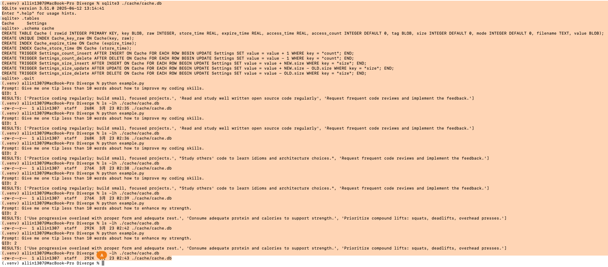

# Diverge + CacheSaver Integration Experiment Report

## 1. Modification 1: Replace LLM Client with CacheSaver Client

### Modification

Original code (divrag_old.py):

```python
from openai import OpenAI as OpenAIClient
...
self.client = OpenAIClient()
```

Modified code (divrag.py):

```python
from cachesaver.models.openai import OpenAI as CachedOpenAI
...
self.namespace = f"diverge_q{qid}"
self.client = CachedOpenAI(
    namespace=self.namespace,
    cachedir="./cache"
)
```

### Purpose

Replace the original OpenAI client with the CacheSaver-wrapped client  
Introduce the concept of namespace for each experiment instance  

### Reason

In the original version, all LLM requests were sent directly to OpenAI without passing through a caching layer.  
After the modification, all requests can go through CacheSaver’s caching logic, providing the foundation for subsequent verification of cache hits and namespace isolation.

## 2. Modification 2: Complete ```QUERY_CACHE_DIR``` Definition

### Modification

Original code (divrag_old.py):

```python
#QUERY_CACHE_DIR = "<Path to  query directory>"
os.makedirs(QUERY_CACHE_DIR, exist_ok=True)
```

Modified code (divrag.py):

```python
#QUERY_CACHE_DIR = "<Path to  query directory>"
QUERY_CACHE_DIR = "./cache/query"
os.makedirs(QUERY_CACHE_DIR, exist_ok=True)
```

### Purpose

Explicitly define the local storage path for query cache  
Ensure that the persistence directory for indices in `_search()` is available  

### Reason

In the old version, QUERY_CACHE_DIR was actually not defined, and the code would raise a NameError at runtime.  
After this line is completed, the retrieval index corresponding to the query can be properly cached locally.

## 3. Modification 3: Adjust the Default Number of Generation Rounds

### Modification

Original code (divrag_old.py):

```python
max_generation_num: int = 5
```

Modified code (divrag.py):

```python
max_generation_num: int = 1
```

### Purpose

Change the default workflow from multi-round generation to single-round generation  
Reduce the uncertainty introduced by dynamic branching  

### Reason

The original Diverge design uses multi-round iterative generation. For cache verification, multi-round generation causes the prompt, query, and context to change in each round, making it difficult to construct a stable cache-hit scenario.  
Therefore, during the experimental stage, the default value was set to 1 to make it easier to verify whether CacheSaver is actually effective.

## 4. Modification 4: Optimize the Cache Loading Logic of `_search()`

### Modification

Original code (divrag_old.py):

```python
qdir = query_cache_dir(query)
if os.path.exists(qdir):
    storage_context = StorageContext.from_defaults(
        persist_dir=qdir
    )
    index = load_index_from_storage(storage_context)
    if index_check(index, query):
        return index
```

Modified code (divrag.py):

```python
qdir = query_cache_dir(query)
# If cached results already exist, load them directly instead of searching again
if os.path.exists(qdir):
    storage_context = StorageContext.from_defaults(persist_dir=qdir)
    return load_index_from_storage(storage_context)
```

### Purpose

If a cached index already exists, load it directly  
Avoid repeatedly executing Google Search and rebuilding the index  

### Reason

The old version first loaded the index and then performed an additional check using ```index_check()```.  
The new version directly adopts the strategy of “if the directory exists, reuse it directly,” which is simpler in logic and also better matches the goal of this experiment: fixing retrieval and verifying caching.

## 5. Modification 5: Unify All LLM Calls to CacheSaver `.request()` (Merged Modification)

### Modification

Replace the following calls in all relevant functions:

```python
resp = self.client.chat.completions.create(...)
```

with:

```python
resp = self.client.request(
    model=self.llm_model,
    messages=[{"role": "user", "content": prompt}]
)
```

Affected functions:

_refine  
_generate_diverse_view  
_generate_query_based_on_view  
_summary_views  

### Purpose

Unify all LLM calls in Diverge under CacheSaver  
Achieve complete call-level caching coverage  

### Reason

CacheSaver only works for the ```.request()``` interface:

Using ```.chat.completions.create()``` → does not go through cache

If only some functions are modified, then the caching pipeline is incomplete; all LLM calls must be replaced in a unified way to ensure that the entire generation process can be cached.

## 6. Modification 6: Rewrite the Final Generation Logic of `_rag()`

### Modification

Original code (divrag_old.py):

```python
response = query_engine.query(self.query)
return str(response)
```

Modified code (divrag.py):

```python
response = query_engine.query(self.query)
context = " ".join(str(response).split())

prompt = f"[{self.namespace}] Say hello"

resp = self.client.request(
    model=self.llm_model,
    messages=[{"role": "user", "content": prompt}]
)
answer = resp.choices[0].message.content.strip()
return answer
```

### Purpose

Include the final generation stage of `_rag()` into CacheSaver  
Normalize the context  
Manually inject the namespace into the prompt  

### Reason

In the old version, `_rag()` directly returns the string result of `query_engine.query()`. This step does not go through CacheSaver.  

In the new version, the response is first extracted, and then the final generation is performed using the CacheSaver client, so that `_rag()` also enters the caching system.  

At the same time,

```python
context = " ".join(str(response).split())
```

is used to remove line breaks and extra spaces, reducing formatting differences.  

Finally,

```python
prompt = f"[{self.namespace}] Say hello"
```

is the most critical verification modification in this experiment: because in actual testing it was found that the key computation of the current CacheSaver version does not automatically include the namespace (as shown in Figure.1), it is therefore necessary to manually place the namespace into the prompt in order to force cache isolation across namespaces.

## 7. Modification 7: Suppress the asyncio Shutdown Message in `example.py`

### Modification

Add the following in `example.py`:

```python
import sys
import asyncio

def silence_asyncio_shutdown():
    def custom_exception_handler(loop, context):
        pass
    loop = asyncio.get_event_loop()
    loop.set_exception_handler(custom_exception_handler)

silence_asyncio_shutdown()
```

### Purpose

Suppress the following output when the program exits:

Task was destroyed but it is pending!

### Reason

CacheSaver internally uses an asyncio batch worker, which leaves a pending task warning when the program exits.  
This warning does not affect the caching logic or the correctness of the results, but it affects the cleanliness of terminal output, so it is suppressed in the example program.

## 8. Modification 8: Adjust the Experimental Parameters and Output in `example.py`

### Modification

In the current `example.py`:

```python
query = "Give me one tip less than 10 words about how to enhance my strength."
qid = 2
num_answers = 3
```

Also add the following prints:

```python
print(f"QID: {qid}")
print("RESULTS:", results)
```

At the same time, use a timestamp to save the results:

```python
with open(f"./results/demo_output_q{qid}_run{time.time_ns()}.txt", "w") as f:
```

### Purpose

Make it easier to observe the namespace corresponding to qid  
Make it easier to check whether the results are consistent across different runs  
Avoid overwriting the result files  

### Reason

During the experimental stage, it is necessary to simultaneously verify:

Whether cache is hit under the same namespace  
Whether cache is not shared across different namespaces  
Whether the results are consistent across different runs  

Therefore, qid and results need to be printed explicitly, and the output filename needs to include a timestamp so that a complete experimental record can be preserved.

## 9. Experimental Results Analysis(as shown in Figure.1)

<p align="center">Figure 1: cache and namespace success</p>

### 9.1 Cache Hit Verification

Experimental procedure:

```bash
python example.py
ls -lh ./cache/cache.db
python example.py
ls -lh ./cache/cache.db
```

Under the condition of a fixed prompt and single-round generation, the following were observed:

The second run was significantly faster  
The output results were exactly the same  
The size of the `cache.db` file no longer increased  

This indicates:

The same request has successfully hit the cache  

### 9.2 Namespace Isolation Verification

In the experiment, qid was changed to different values, for example:

```python
qid = 1
qid = 2
```

Since the prompt contains:

```python
f"[{self.namespace}] Say hello"
```

the requests corresponding to different qid values are no longer the same, and `cache.db` continues to grow.  
This indicates:

Different namespaces have been successfully isolated and no longer share cache  

### 9.3 Final Conclusion

After these modifications, the system has achieved the following goals:

- CacheSaver has been successfully integrated into Diverge  
- All major LLM calls have been uniformly brought into the caching system  
- A query-based retrieval cache and a call-level LLM cache coexist in the current system  
- By manually injecting the namespace into the prompt, cache is no longer shared across namespaces  
- By using a single round and a fixed prompt, cache-hit behavior has been successfully verified  

However, it should also be noted that:

Diverge itself emphasizes diversity, while CacheSaver relies on repeated requests.  

Therefore, in a real multi-round Diverge scenario, the hit rate of call-level cache is naturally low.  
This experiment shows that CacheSaver is more suitable for:

- Reproducing experiments  
- Debugging  
- Recording reasoning traces  

If needed in future work, the system can also be modified to support `query-level caching`, i.e., directly reusing the final results for the same user query rather than only caching underlying LLM calls.